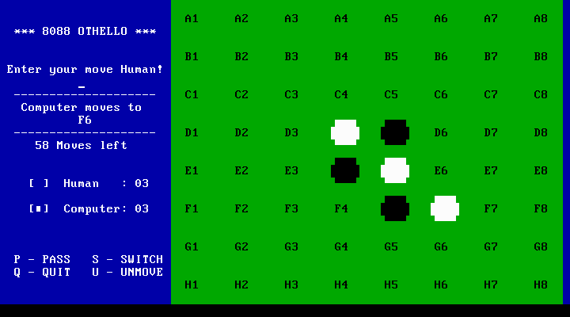

# NASM-OTHELLO-8088-GAME
All copyrights to source code own by Michael W. Bayley, please contact with me if this repository violates the law.
<figure></figure>
Source code of game disassembled with Ghidra and turn into NASM format with 
[Ghidra to NASM converter](https://github.com/shadwork/Ghidra-To-NASM-X86-Converter) 

After that - it tuned with bare hands and now games can be assembled with NASM into properly DOS executable COM file.
This is not byte-to-byte resul, cause to NASM optimize some 8086 mnemonics, but resulting size of executables file is the same with original.

Main goal of this repository is played with assembler sources in modern world:
 - add localization
 - properly timings
 - porting into 64 bit

To build project you need NASM end enter assemble command

`nasm othello.asm -fbin -o othello.com`

